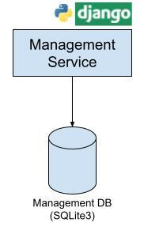

# Basketball League Management

**Basketball League Management** is a sample RESTFul web service that simulates the management-related activities of a basketball league. 

This application is used to demonstrate how developers can use [`Django REST Framework`](https://www.django-rest-framework.org/) to build modernized REST APIs with minimum code.

The following component diagram depicts the current architecture of this sample application.



## Prerequisites

1. Python 3.8.x
2. Django 4.2.1
3. Django REST Framework 3.14.0

## Run the application

1. Clone the repository.
```sh
git clone https://github.com/ayeshLK/basketball-league-management

cd basketball-league-management/
```

2. Create a virtual environment to run the application.
```sh
python3 -m venv env

source env/bin/activate
```

3. Install the required dependencies.
```sh
pip install -r requirements.txt
```

4. Go into the project directory and run the required migrations.
```sh
cd basketball_league/

python manage.py migrate
```

5. Run the server using the following command.
```sh
python manage.py runserver
```

## Accessing the API

The API has been developed with in-built support for browsability. Go to [`http://127.0.0.1:8000/`](http://127.0.0.1:8000/) in your browser. In the API root, all the available APIs will be listed and you can browse through the APIs by clicking on the relevant URLs.
